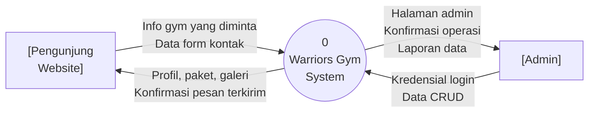
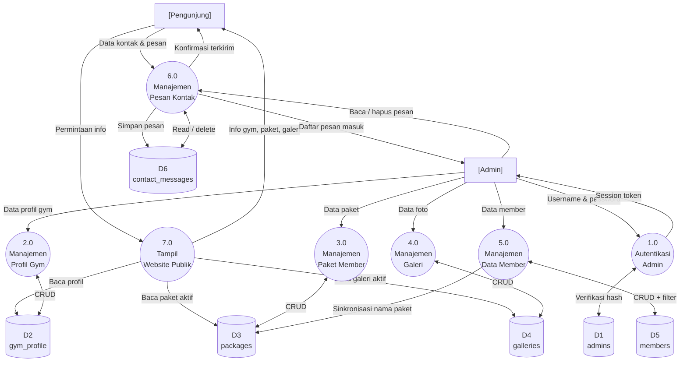

# DFD — Data Flow Diagram
# Warriors Gym Website

Dokumen ini menggambarkan aliran data pada sistem Warriors Gym dari level 0 (konteks) hingga level 1 (proses utama).

**Notasi yang digunakan:**
- `[Entitas Eksternal]` — sumber atau tujuan data di luar sistem
- `(Proses)` — proses yang mengolah data
- `=Penyimpanan Data=` — tempat data disimpan

---

## Level 0 — Context Diagram

Gambaran tingkat tertinggi: sistem sebagai satu proses tunggal yang berinteraksi dengan dua entitas eksternal.

---

## Level 1 — Diagram Proses Utama

Sistem dipecah menjadi 6 proses utama beserta penyimpanan data yang terlibat.

---

## Detail Proses Level 1

### 1.0 — Autentikasi Admin

| Aliran | Dari / Ke | Keterangan |
|---|---|---|
| Input | Admin | Username + password |
| Proses | Verifikasi `password_verify()` terhadap `admins.password_hash` |
| Output | Admin | PHP Session aktif |
| Store | `admins` | Baca data hash |

### 2.0 — Manajemen Profil Gym

| Aliran | Dari / Ke | Keterangan |
|---|---|---|
| Input | Admin | Form data profil |
| Proses | INSERT atau UPDATE `gym_profile` |
| Output | Admin | Redirect + flash message |
| Store | `gym_profile` | Tulis |

### 3.0 — Manajemen Paket Member

| Aliran | Dari / Ke | Keterangan |
|---|---|---|
| Input | Admin | Form paket (nama, harga, benefits) |
| Proses | CRUD pada tabel `packages` |
| Output | Admin | Daftar paket terbaru |
| Store | `packages` | Baca / Tulis |

### 4.0 — Manajemen Galeri

| Aliran | Dari / Ke | Keterangan |
|---|---|---|
| Input | Admin | Form foto (path, judul, kategori) |
| Proses | CRUD pada tabel `galleries` |
| Output | Admin | Grid foto terbaru |
| Store | `galleries` | Baca / Tulis |

### 5.0 — Manajemen Data Member

| Aliran | Dari / Ke | Keterangan |
|---|---|---|
| Input | Admin | Form member + filter pencarian |
| Proses | CRUD + kalkulasi status (aktif/kadaluarsa/ditangguhkan) |
| Output | Admin | Tabel member terfilter |
| Store | `members`, `packages` | Baca / Tulis |

### 6.0 — Manajemen Pesan Kontak

| Aliran | Dari / Ke | Keterangan |
|---|---|---|
| Input Pengunjung | Pengunjung | Nama, email, no. HP, pesan |
| Input Admin | Admin | Aksi tandai dibaca / hapus |
| Proses | INSERT (dari pengunjung) / UPDATE-DELETE (dari admin) |
| Output Pengunjung | Pengunjung | Konfirmasi pesan diterima |
| Output Admin | Admin | Daftar pesan masuk dengan status |
| Store | `contact_messages` | Baca / Tulis |

### 7.0 — Tampil Website Publik

| Aliran | Dari / Ke | Keterangan |
|---|---|---|
| Input | Pengunjung | Navigasi halaman |
| Proses | Baca data dari localStorage (data di-render via JS dari `defaultData`) |
| Output | Pengunjung | Halaman profil, paket, galeri |
| Store | `gym_profile`, `packages`, `galleries` | Baca saja |

> **Catatan:** Proses 7.0 saat ini membaca dari `localStorage` pada sisi browser (frontend statis). Untuk sinkronisasi penuh dengan MySQL, frontend perlu dikonversi ke PHP atau membaca dari REST API.
