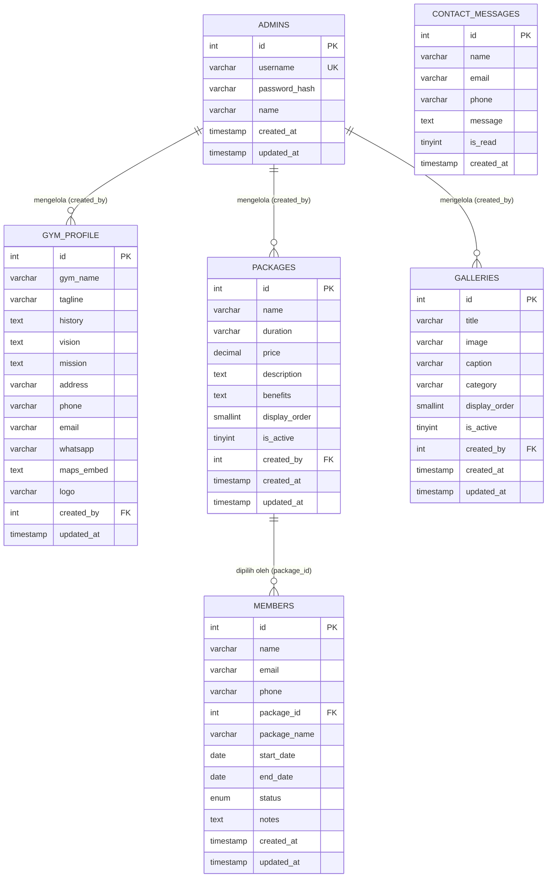

# ERD — Entity Relationship Diagram
# Warriors Gym Database

Diagram ini menggambarkan struktur tabel dan relasi antar entitas pada database `gym_db`.

---

## Diagram ERD

---

## Keterangan Entitas

| Tabel | Keterangan |
|---|---|
| `admins` | Akun pengelola sistem. Password disimpan dalam bcrypt hash. |
| `gym_profile` | Data profil gym — singleton (satu baris aktif). Dikelola admin. |
| `packages` | Daftar paket keanggotaan. Kolom `benefits` menyimpan JSON array. |
| `galleries` | Foto fasilitas gym. Path gambar relatif terhadap root project. |
| `members` | Data member gym. `status` bisa: `active`, `expired`, `suspended`. |
| `contact_messages` | Pesan masuk dari pengunjung publik. Tidak memerlukan akun. |

---

## Keterangan Relasi

| Relasi | Jenis | Keterangan |
|---|---|---|
| `admins` → `gym_profile` | 1 : N | Satu admin bisa mengelola banyak versi profil |
| `admins` → `packages` | 1 : N | Satu admin bisa membuat banyak paket |
| `admins` → `galleries` | 1 : N | Satu admin bisa menambah banyak foto |
| `packages` → `members` | 1 : N | Satu paket bisa dipilih banyak member |
| `contact_messages` | Standalone | Tidak berelasi ke entitas lain |

---

## Catatan

- `benefits` di tabel `packages` disimpan sebagai JSON string, contoh: `["Akses area utama","Kelas grup","Loker gratis"]`
- `status` di tabel `members` adalah ENUM: nilai di luar `active`/`expired`/`suspended` tidak diterima
- `package_name` di `members` menyimpan nama paket secara redundan — dimaksudkan agar nama paket tetap terbaca meski paket dihapus dari tabel `packages`
