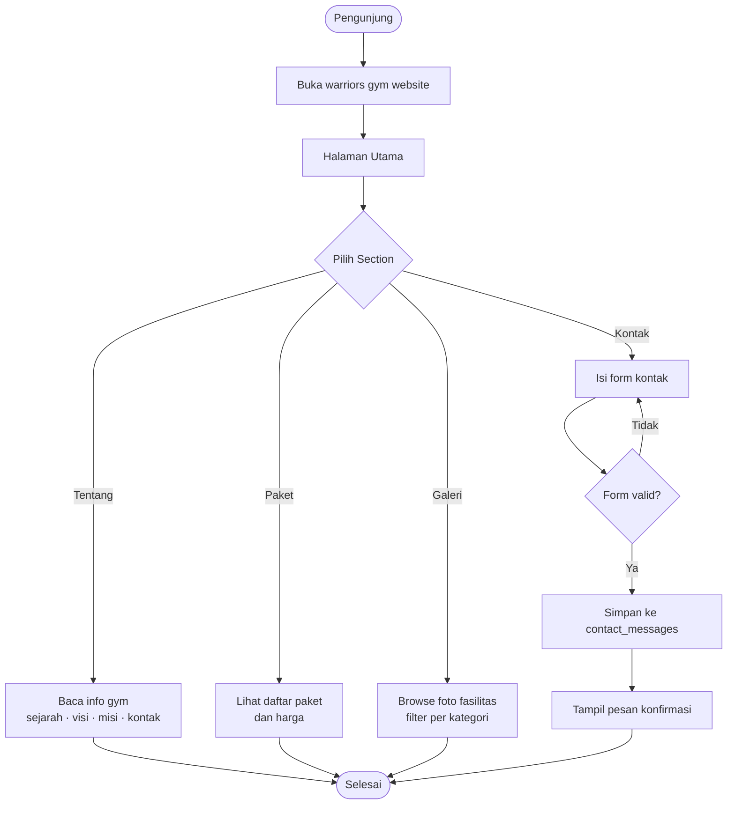
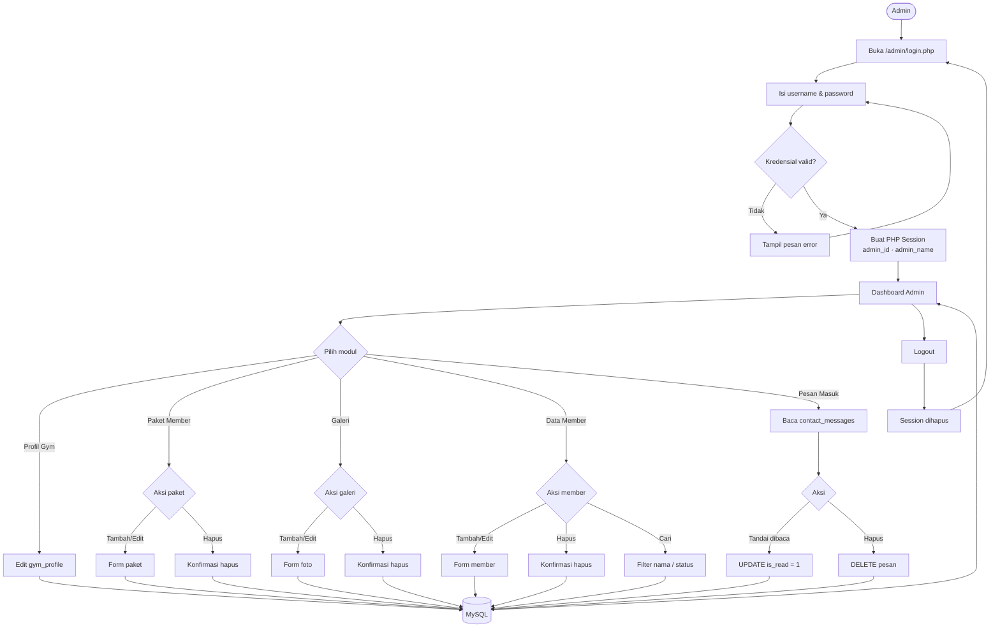
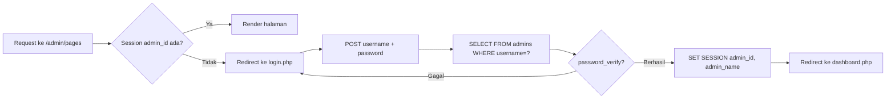

# Flowchart Sistem — Warriors Gym

Dokumen ini menggambarkan alur kerja sistem website Warriors Gym, mencakup dua aktor utama: **Pengunjung** dan **Admin**.

---

## Alur Pengunjung (Public)

---

## Alur Admin

---

## Alur Autentikasi

