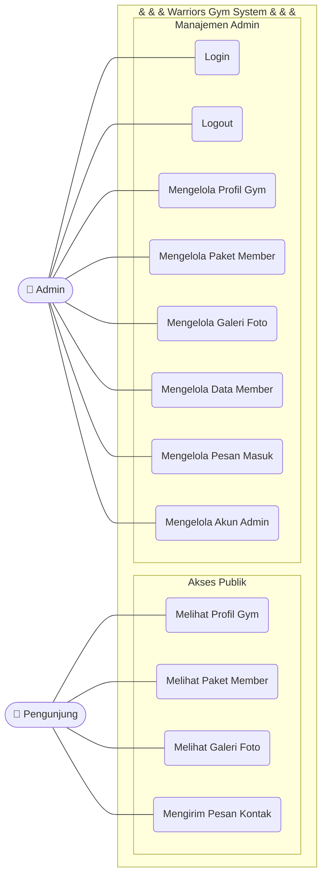
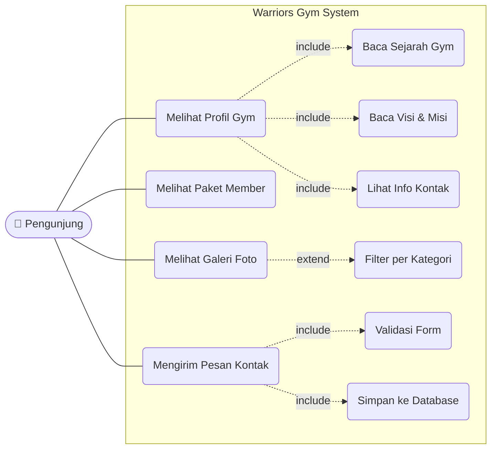
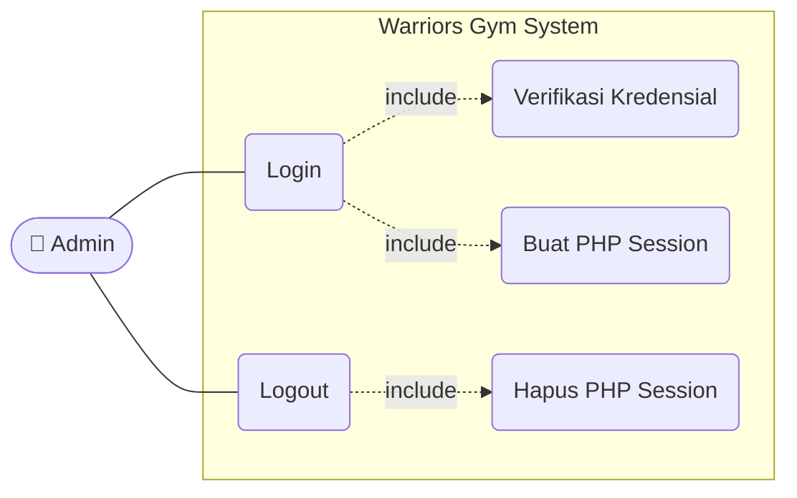
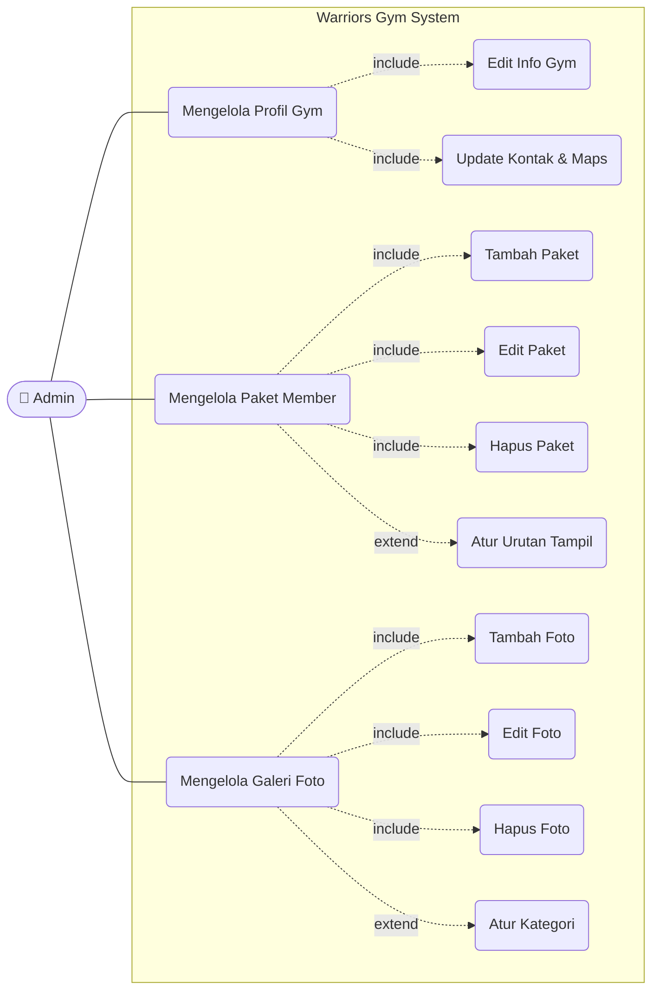
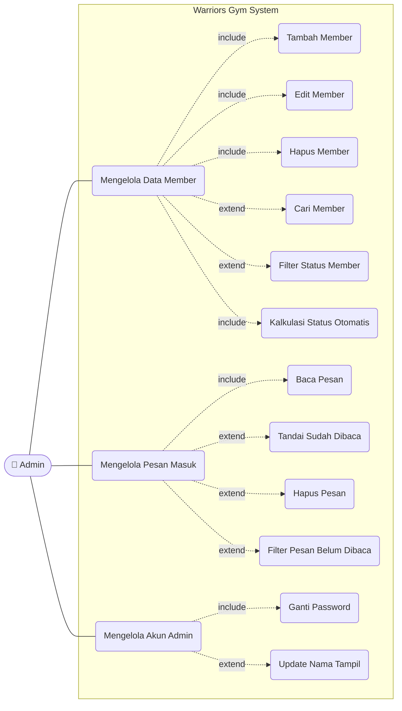

# Use Case Diagram — Warriors Gym

Dokumen ini menggambarkan interaksi antara aktor dan fungsionalitas sistem Warriors Gym.

**Aktor:**
- **Pengunjung** — pengguna publik yang mengakses website tanpa login
- **Admin** — pengelola sistem yang mengakses panel admin setelah login

---

## Diagram Utama (Overview)

---

## Detail Use Case — Pengunjung

---

## Detail Use Case — Admin (Autentikasi)

---

## Detail Use Case — Admin (Kelola Konten)

---

## Detail Use Case — Admin (Member & Pesan)

---

## Tabel Use Case Lengkap

### Pengunjung

| ID | Use Case | Deskripsi | Relasi |
|---|---|---|---|
| UC-01 | Melihat Profil Gym | Membaca info gym: sejarah, visi, misi, alamat, kontak | — |
| UC-02 | Melihat Paket Member | Melihat daftar paket keanggotaan dan harga | — |
| UC-03 | Melihat Galeri Foto | Browse foto fasilitas, filter per kategori | extend UC-03a |
| UC-03a | Filter Galeri per Kategori | Filter foto berdasarkan kategori (Ruang Utama, Kardio, dll) | extend dari UC-03 |
| UC-04 | Mengirim Pesan Kontak | Mengisi dan submit form kontak | include UC-04a, UC-04b |
| UC-04a | Validasi Form | Cek kelengkapan field sebelum submit | include dari UC-04 |
| UC-04b | Simpan Pesan ke DB | INSERT ke tabel `contact_messages` | include dari UC-04 |

### Admin

| ID | Use Case | Deskripsi | Relasi |
|---|---|---|---|
| UC-05 | Login | Verifikasi username & password, buat session | include UC-05a, UC-05b |
| UC-05a | Verifikasi Kredensial | `password_verify()` terhadap hash di tabel `admins` | include dari UC-05 |
| UC-05b | Buat PHP Session | Set `$_SESSION['admin_id']` dan `admin_name` | include dari UC-05 |
| UC-06 | Logout | Hapus session dan redirect ke login | include UC-06a |
| UC-07 | Mengelola Profil Gym | CRUD data `gym_profile` | include UC-07a, UC-07b |
| UC-08 | Mengelola Paket Member | CRUD data `packages` | include UC-08a/b/c |
| UC-08d | Atur Urutan Tampil | Menentukan `display_order` paket di halaman publik | extend dari UC-08 |
| UC-09 | Mengelola Galeri Foto | CRUD data `galleries` | include UC-09a/b/c |
| UC-09d | Atur Kategori Foto | Menentukan kategori foto untuk filter galeri | extend dari UC-09 |
| UC-10 | Mengelola Data Member | CRUD data `members` | include UC-10a/b/c/f |
| UC-10d | Cari Member | Cari berdasarkan nama, email, atau no. HP | extend dari UC-10 |
| UC-10e | Filter Status Member | Filter berdasarkan status: aktif/kadaluarsa/ditangguhkan | extend dari UC-10 |
| UC-10f | Kalkulasi Status Otomatis | Status dikalkulasi dari `end_date` vs tanggal hari ini | include dari UC-10 |
| UC-11 | Mengelola Pesan Masuk | Baca, tandai, dan hapus `contact_messages` | include UC-11a |
| UC-11b | Tandai Sudah Dibaca | UPDATE `is_read = 1` satu atau semua pesan | extend dari UC-11 |
| UC-11d | Filter Pesan Belum Dibaca | Tampil hanya pesan dengan `is_read = 0` | extend dari UC-11 |
| UC-12 | Mengelola Akun Admin | Ganti password dan nama tampil | include UC-12a |
| UC-12b | Update Nama Tampil | Perbarui `name` di tabel `admins` | extend dari UC-12 |

---

## Keterangan Relasi

| Simbol | Keterangan |
|---|---|
| `---` | Association — aktor berinteraksi langsung dengan use case |
| `-.->` include | Use case yang selalu dieksekusi saat use case utama dijalankan |
| `-.->` extend | Use case opsional yang memperluas perilaku use case utama |
